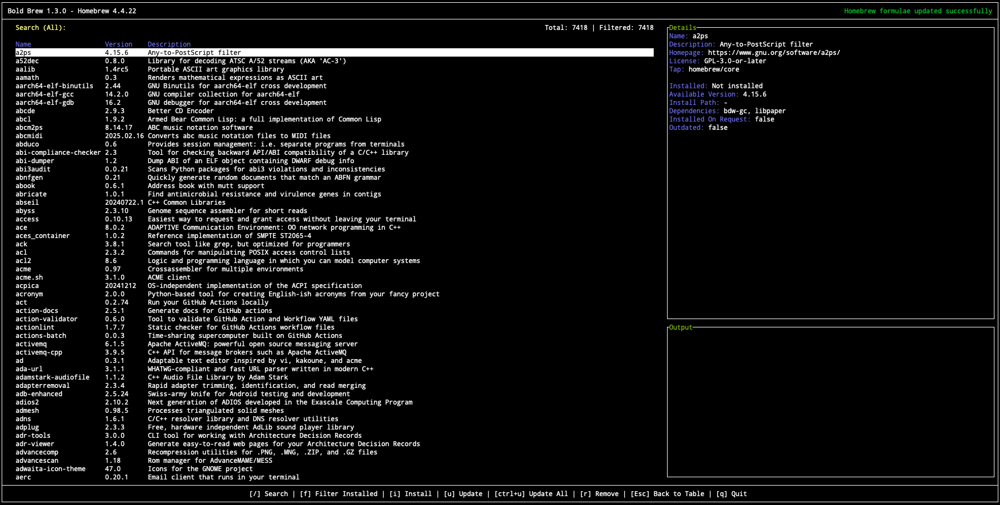
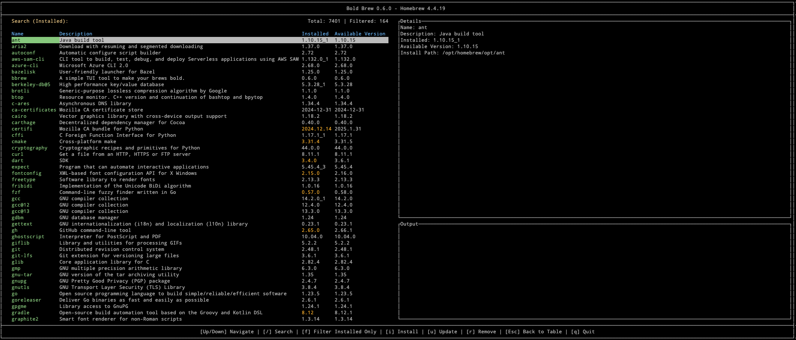

# Bold Brew (bbrew) - A Homebrew TUI Manager

   

   


**Bold Brew** is a TUI application that allows you to manage your Homebrew packages on macOS. It provides a simple and intuitive interface to install, uninstall, and update packages. It also allows you to search for packages and view detailed information about them.




## Table of Contents

- [Installation](#installation)
- [Usage](#usage)
- [Contributing](#contributing)
- [License](#license)

## Installation

To install **Bold Brew**, you can use the pre-built binaries available on the [releases page](https://github.com/Valkyrie00/bold-brew/releases).

### Homebrew

You can also install **Bold Brew** using Homebrew:

```sh
brew tap Valkyrie00/homebrew-bbrew
brew install bbrew
```

## Usage
To run **Bold Brew** simply execute:
```sh
bbrew
```
This will launch the TUI application where you can navigate and manage your Homebrew packages.


## Contributing
Contributions are welcome! Please open an issue or submit a pull request on GitHub.

## License
This project is licensed under the MIT License - see the [LICENSE](LICENSE) file for details.
```