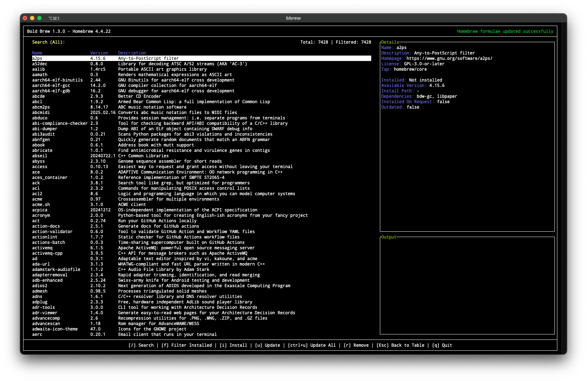
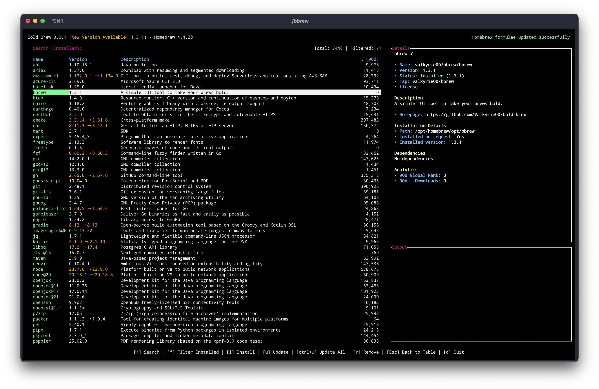
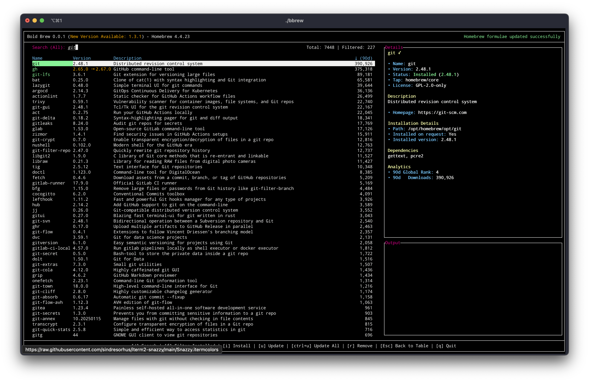

<div align="center">
  
  <h1>Bold Brew (bbrew)</h1>
  <p>A modern Terminal UI for managing Homebrew packages and casks</p>
</div>

<div align="center">


[](https://github.com/Valkyrie00/bold-brew/stargazers)
[](https://github.com/Valkyrie00/bold-brew/network/members)

[Website](https://bold-brew.com/) • [Docs](https://bold-brew.com/docs) • [Changelog](https://github.com/Valkyrie00/bold-brew/releases)

</div>

---

<div align="center">

### 🌟 Official Homebrew TUI for Project Bluefin

Bold Brew is the **official Terminal UI** for managing Homebrew in [**Project Bluefin**](https://projectbluefin.io/), a next-generation Linux desktop that serves tens of thousands of users worldwide.

*"This application features full package management for homebrew in a nice nerdy interface"*  
— [Bluefin Documentation](https://docs.projectbluefin.io/command-line/)

[](https://projectbluefin.io/)
[](https://universal-blue.org/)

</div>

---

## ✨ Features

- 🚀 **Modern TUI Interface** - Clean and responsive terminal user interface
- 📦 **Complete Package Management** - Manage both Homebrew formulae and casks
- 🔍 **Advanced Search** - Fast fuzzy search across all packages
- 🎯 **Smart Filters** - Filter by installed, outdated, leaves, or casks
- 📊 **Analytics Integration** - See popular packages based on 90-day download stats
- 🔄 **Real-time Updates** - Live feedback during package operations
- ⌨️ **Keyboard Shortcuts** - Intuitive keybindings for all operations
- 🎨 **Type Indicators** - Visual distinction between formulae [F] and casks [C]
- 🗂️ **XDG Compliance** - Follows XDG Base Directory Specification for cache storage
- 🔒 **Security Scanning** - Automated vulnerability and security checks

## 🛠️ Installation

### Via Homebrew
```sh
brew install Valkyrie00/homebrew-bbrew/bbrew
```

### Manually
Download the latest version from the [releases page](https://github.com/Valkyrie00/bold-brew/releases)

## 📖 Quick Start

Launch the application:
```sh
bbrew
```

### Keyboard Shortcuts

#### Navigation & Search
- `/` - Search packages (fuzzy search)
- `↑/↓` or `j/k` - Navigate package list
- `Enter` - View package details
- `Esc` - Clear search / Close modals

#### Filters
- `F` - Filter installed packages
- `O` - Filter outdated packages
- `L` - Filter leaves (explicitly installed, no dependencies)
- `C` - Filter casks only

#### Package Operations
- `I` - Install selected package
- `U` - Update selected package
- `R` - Remove selected package
- `Ctrl+U` - Update all outdated packages

#### Other
- `Ctrl+R` - Refresh package database
- `Q` - Quit application
- `?` - Show help (if available)

## 📋 What's New in v2.0.0

### 🎉 Major Features
- **Homebrew Casks Support** - Full support for managing GUI applications and binaries
- **Leaves Filter** - Show only explicitly installed packages (excluding dependencies)
- **XDG Base Directory Support** - Cache follows platform standards (`~/.cache/bbrew` on Linux, `~/Library/Caches/bbrew` on macOS)
- **Type Indicators** - Clear visual distinction between formulae `[F]` and casks `[C]`

### 🔧 Technical Improvements
- Updated to Go 1.25
- Migrated to Podman and OCI-compliant Containerfile
- Enhanced Makefile with 15+ new targets and help system
- Integrated automated security scanning (govulncheck + gosec)
- Fixed implicit memory aliasing issues
- Improved error handling and logging

### 🐛 Bug Fixes
- Fixed cask analytics endpoint
- Corrected installed casks detection
- Fixed tview special character rendering for type tags
- Improved directory permission handling (0750)

## 🖼️ Screenshots

<div align="center">
  
  <p><em>Main interface with package list and filters</em></p>
  
  
  <p><em>Filtered view showing installed packages</em></p>
  
  
  <p><em>Fuzzy search in action</em></p>
</div>

## 🔧 Development

### Prerequisites
- Go 1.25+
- Homebrew (for testing)
- Podman (optional, for containerized builds)

### Building from Source
```sh
# Clone the repository
git clone https://github.com/Valkyrie00/bold-brew.git
cd bold-brew

# Build locally
make build-local

# Run tests
make test

# Run linter
make quality-local

# Run security scans
make security
```

### Project Structure
```
bold-brew/
├── cmd/bbrew/           # Main application entry point
├── internal/
│   ├── models/          # Data models (Formula, Cask, Package)
│   ├── services/        # Business logic (Brew, App, I/O)
│   └── ui/              # TUI components and layout
├── .github/workflows/   # CI/CD pipelines
└── Makefile             # Build automation
```

## 🤝 Contributing

Contributions are welcome! Please:

1. 🍴 Fork the project
2. 🔨 Create your feature branch (`git checkout -b feat/amazing-feature`)
3. 📝 Commit your changes using [Conventional Commits](https://www.conventionalcommits.org/)
4. 🧪 Run tests and linters (`make test quality-local`)
5. 🚀 Push to the branch (`git push origin feat/amazing-feature`)
6. 📬 Open a Pull Request

### Commit Message Format
We follow Conventional Commits:
- `feat:` - New features
- `fix:` - Bug fixes
- `docs:` - Documentation changes
- `refactor:` - Code refactoring
- `chore:` - Maintenance tasks
- `test:` - Test updates

## 🦸Contributors
Bold Brew exists thanks to the efforts of these wonderful people

<a href="https://github.com/Valkyrie00/bold-brew/graphs/contributors">
  
</a>

## 📄 License

This project is licensed under the MIT License - see the [LICENSE](LICENSE) file for details.

## 🛡️ Security

Security is a priority for Bold Brew. We use:
- **govulncheck** - Go vulnerability database scanning
- **gosec** - Static security analysis
- **Automated CI/CD** - Security checks on every PR and push

Found a security issue? Please report it privately via [GitHub Security Advisories](https://github.com/Valkyrie00/bold-brew/security/advisories).

## 📊 Platform Support

| Platform | Support | Notes |
|----------|---------|-------|
| 🍎 **macOS** | ✅ Full | Native Homebrew support |
| 🐧 **Linux** | ✅ Full | Linuxbrew/Homebrew support |

## 💖 Support

- 🌟 [Star the project](https://github.com/Valkyrie00/bold-brew)
- 🐛 [Report a bug](https://github.com/Valkyrie00/bold-brew/issues/new?labels=bug)
- 💡 [Request a feature](https://github.com/Valkyrie00/bold-brew/issues/new?labels=enhancement)
- 📣 Share the project with your friends
- ☕ [Sponsor the project](https://github.com/sponsors/Valkyrie00) (if available)

---

<div align="center">
  <sub>Built with ❤️ for the community and for all developers</sub>
</div>
