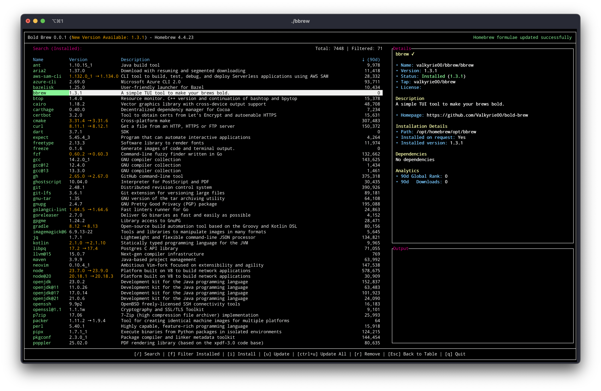

<div align="center">
  
  <h1>Bold Brew (bbrew)</h1>
  <p>A modern Terminal UI for managing Homebrew packages and casks</p>
</div>

<div align="center">


[](https://github.com/Valkyrie00/bold-brew/stargazers)
[](https://github.com/Valkyrie00/bold-brew/network/members)

[Website](https://bold-brew.com/) • [Changelog](https://github.com/Valkyrie00/bold-brew/releases)

</div>

---

<div align="center">

### 🌟 Official Homebrew TUI for Project Bluefin

Bold Brew is the **official Terminal UI** for managing Homebrew in [**Project Bluefin**](https://projectbluefin.io/) and [**Aurora**](https://getaurora.dev), next-generation Linux desktops that serve tens of thousands of users worldwide.

*"This application features full package management for homebrew in a nice nerdy interface"*  
— [Bluefin Documentation](https://docs.projectbluefin.io/command-line/)

[](https://projectbluefin.io/)
[](https://getaurora.dev)
[](https://universal-blue.org/)

</div>

---

## ✨ Features

- 🚀 **Modern TUI Interface** - Clean and responsive terminal user interface
- 📦 **Complete Package Management** - Manage Homebrew formulae, casks, Flatpak, and Mac App Store apps
- 📋 **Brewfile Mode** - Curated package collections from local or remote Brewfiles (supports `brew`, `cask`, `tap`, `mas`, and `flatpak` entries)
- 🔍 **Advanced Search** - Fast fuzzy search across all packages
- 🎯 **Smart Filters** - Filter by installed, outdated, leaves, casks, or formulae
- 📊 **Analytics Integration** - See popular packages based on 90-day download stats
- 🔄 **Real-time Updates** - Live feedback during package operations
- ⌨️ **Keyboard Shortcuts** - Intuitive keybindings for all operations
- 🎨 **Type Indicators** - Visual distinction between formulae [F], casks [C], and Mac App Store [M]
- 🔀 **Sort Modes** - Sort packages by downloads or name
- 📤 **Brewfile Export** - Generate a Brewfile from currently installed packages
- 🛡️ **Vulnerability Scanning** - On-demand CVE scanning via `brew vulns` (Homebrew 6+)
- ⚠️ **Health Indicators** - Deprecated/disabled package warnings with replacement suggestions
- 🗂️ **XDG Compliance** - Follows XDG Base Directory Specification for cache storage
- 🔒 **Security Scanning** - Automated vulnerability and security checks in CI
- ⚡ **Homebrew 6 Ready** - Full compatibility with Homebrew 6.0 (ask mode, tap trust, JSON v2)

## 🛠️ Installation

### Quick Install (Recommended)
Install Homebrew + Bold Brew with a single command:
```sh
/bin/bash -c "$(curl -fsSL https://raw.githubusercontent.com/Valkyrie00/bold-brew/main/install.sh)"
```

### Via Homebrew
If you already have Homebrew installed:
```sh
brew install Valkyrie00/bbrew/bbrew
```

### Manually
Download the latest version from the [releases page](https://github.com/Valkyrie00/bold-brew/releases)

## 📖 Quick Start

### Standard Mode
Launch the application to browse all Homebrew packages:
```sh
bbrew
```

### Brewfile Mode
Launch with a curated Brewfile to show only specific packages:
```sh
# Local Brewfile
bbrew -f /path/to/Brewfile

# Remote Brewfile (HTTPS)
bbrew -f https://raw.githubusercontent.com/user/repo/main/Brewfile
```

In Brewfile mode, you can:
- View only packages from the Brewfile
- Pick and choose what to install individually
- Use all standard features (search, filters, etc.)
- Load Brewfiles directly from URLs (great for sharing configurations!)

Perfect for creating themed collections like IDE choosers, dev tools, AI tools, K8s tools, etc.

See the `examples/` directory for ready-to-use Brewfiles.

### CLI Options

```sh
bbrew [options]

Options:
  -f <path|url>   Path or URL to Brewfile (local file or HTTPS URL)
  -v, --version   Show version information
  -h, --help      Show help message
```

### Keyboard Shortcuts

#### Navigation & Search
- `/` - Search packages
- `↑/↓` or `j/k` - Navigate package list
- `Enter` - View package details
- `Esc` - Clear search / Back to table
- `?` - Show help screen

#### Filters & Sorting
- `f` - Filter installed packages
- `o` - Filter outdated packages
- `l` - Filter leaves (explicitly installed)
- `c` - Filter casks only
- `F` - Filter formulae only
- `s` - Cycle sort mode (None → Downloads → Name)

#### Package Operations
- `i` - Install selected package
- `u` - Update selected package
- `r` - Remove selected package
- `v` - Vulnerability scan (selected package)
- `e` - Export installed packages to ~/Brewfile
- `Ctrl+U` - Update all outdated packages

#### Brewfile Mode Only
- `Ctrl+A` - Install all packages from Brewfile
- `Ctrl+R` - Remove all packages from Brewfile

#### Other
- `q` - Quit application

## 🖼️ Screenshots

<div align="center">
  
  <p><em>Filtered view showing installed packages</em></p>
  
  
  <p><em>Fuzzy search in action</em></p>
  
  
  <p><em>Brewfile mode with curated package selection</em></p>
</div>

## 📊 Platform Support

| Platform | Support | Notes |
|----------|---------|-------|
| 🍎 **macOS** | ✅ Full | Native Homebrew support |
| 🐧 **Linux** | ✅ Full | Linuxbrew/Homebrew support |

## 🛡️ Security

Security is a priority for Bold Brew. We use:
- **govulncheck** - Go vulnerability database scanning
- **gosec** - Static security analysis
- **brew vulns** - On-demand CVE scanning for installed Homebrew packages (requires `brew install homebrew/brew-vulns/brew-vulns`)
- **Automated CI/CD** - Security checks and tests on every PR and push

Found a security issue? Please report it privately via [GitHub Security Advisories](https://github.com/Valkyrie00/bold-brew/security/advisories).

## 🔧 Development

### Prerequisites
- Go 1.25+
- Homebrew (for testing)
- Podman (optional, for containerized builds)

### Building from Source
```sh
# Clone the repository
git clone https://github.com/Valkyrie00/bold-brew.git
cd bold-brew

# Build locally
make build-local

# Run tests
make test

# Run linter
make quality-local

# Run security scans
make security
```

### Project Structure
```
bold-brew/
├── cmd/bbrew/           # Main application entry point
├── internal/
│   ├── models/          # Data models (Formula, Cask, Package, Sort)
│   ├── services/        # Business logic (Brew, App, Search, Input, Brewfile, Vulns, Export, Mas)
│   └── ui/              # TUI components, layout, and thread-safe writer
├── .github/workflows/   # CI/CD pipelines (quality, security, release, test-install)
└── Makefile             # Build automation
```

## 🤝 Contributing

Contributions are welcome! Please:

1. 🍴 Fork the project
2. 🔨 Create your feature branch (`git checkout -b feat/amazing-feature`)
3. 📝 Commit your changes using [Conventional Commits](https://www.conventionalcommits.org/)
4. 🧪 Run tests and linters (`make test quality-local`)
5. 🚀 Push to the branch (`git push origin feat/amazing-feature`)
6. 📬 Open a Pull Request

## 🦸Contributors
Bold Brew exists thanks to the efforts of these wonderful people

<a href="https://github.com/Valkyrie00/bold-brew/graphs/contributors">
  
</a>

## 📄 License

This project is licensed under the MIT License - see the [LICENSE](LICENSE) file for details.

## 💖 Support

- 🌟 [Star the project](https://github.com/Valkyrie00/bold-brew)
- 🐛 [Report a bug](https://github.com/Valkyrie00/bold-brew/issues/new?labels=bug)
- 💡 [Request a feature](https://github.com/Valkyrie00/bold-brew/issues/new?labels=enhancement)
- 📣 Share the project with your friends

---

<div align="center">
  <sub>Built with ❤️ for the community and for all developers</sub>
</div>
