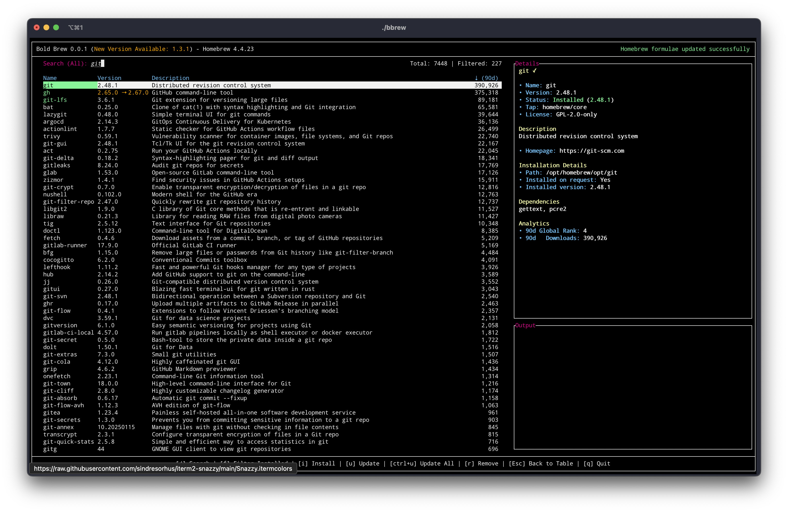
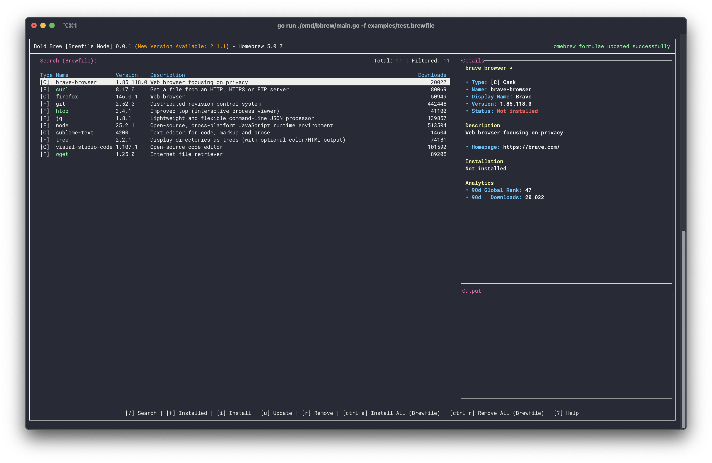

<div align="center">
  
  <h1>Bold Brew</h1>
  <p><strong>A modern Terminal UI for Homebrew, Flatpak, and Mac App Store</strong></p>

  
  
  
  
  
  

  [Website](https://bold-brew.com/) · [Changelog](https://github.com/Valkyrie00/bold-brew/releases) · [Report Bug](https://github.com/Valkyrie00/bold-brew/issues/new?labels=bug) · [Request Feature](https://github.com/Valkyrie00/bold-brew/issues/new?labels=enhancement)

</div>

---

<div align="center">
  
  <p><em>Browse, search, filter, and manage thousands of packages without leaving the terminal</em></p>
</div>

---

## Why Bold Brew?

Homebrew is powerful, but managing hundreds of packages from the command line is tedious. Bold Brew gives you a **visual interface** to browse, search, and manage everything — formulae, casks, Flatpak apps, and Mac App Store apps — from a single keyboard-driven TUI.

- **See everything at a glance** — installed status, outdated packages, download popularity
- **Curate with Brewfiles** — load local or remote Brewfiles for themed package collections
- **Stay secure** — scan packages for CVEs with one keystroke
- **Works with Homebrew 4, 5, and 6** — leverages the latest features automatically

---

<div align="center">

### Official Homebrew TUI for Project Bluefin

Bold Brew is the **official Terminal UI** for managing Homebrew in [**Project Bluefin**](https://projectbluefin.io/) and [**Aurora**](https://getaurora.dev), next-generation Linux desktops serving tens of thousands of users worldwide.

*"This application features full package management for homebrew in a nice nerdy interface"*
— [Bluefin Documentation](https://docs.projectbluefin.io/command-line/)

[](https://projectbluefin.io/)
[](https://getaurora.dev)
[](https://universal-blue.org/)

</div>

---

## Features

### Package Management
Manage **Homebrew formulae**, **casks**, **Flatpak**, and **Mac App Store** apps from one interface. Install, update, and remove packages with confirmation dialogs and real-time streaming output.

### Discovery and Filtering
Fast search across 15,000+ packages. Filter by installed, outdated, leaves, casks, or formulae. Sort by download popularity or name. See type indicators `[F]` `[C]` `[M]` at a glance.

### Brewfile Workflows
Load Brewfiles from local paths or remote URLs. Batch install/remove entire collections. Export your installed packages to a `~/Brewfile` with one keystroke. Supports `brew`, `cask`, `tap`, `mas`, and `flatpak` entries.

### Security and Health
On-demand **vulnerability scanning** via `brew vulns` (press `v`). Deprecated and disabled package warnings with replacement suggestions. Full Homebrew 6.0 compatibility including tap trust and ask mode.

---

## Installation

### Quick Install (Recommended)

Install Homebrew + Bold Brew with a single command:

```sh
/bin/bash -c "$(curl -fsSL https://raw.githubusercontent.com/Valkyrie00/bold-brew/main/install.sh)"
```

### Via Homebrew

```sh
brew install Valkyrie00/bbrew/bbrew
```

### Manual Download

Grab the latest binary from the [releases page](https://github.com/Valkyrie00/bold-brew/releases).

---

## Quick Start

```sh
# Browse all packages
bbrew

# Load a Brewfile (local or remote)
bbrew -f ~/Brewfile
bbrew -f https://raw.githubusercontent.com/user/repo/main/Brewfile
```

See the `examples/` directory for ready-to-use Brewfiles (dev tools, AI tools, K8s, etc.).

---

<details>
<summary><strong>Keyboard Shortcuts</strong></summary>

### Navigation

| Key | Action |
|-----|--------|
| `/` | Search packages |
| `↑/↓` or `j/k` | Navigate list |
| `Esc` | Back to table |
| `?` | Help screen |
| `q` | Quit |

### Filters and Sorting

| Key | Action |
|-----|--------|
| `f` | Toggle installed |
| `o` | Toggle outdated |
| `l` | Toggle leaves |
| `c` | Toggle casks |
| `F` | Toggle formulae |
| `s` | Cycle sort (None → Downloads → Name) |

### Package Operations

| Key | Action |
|-----|--------|
| `i` | Install selected |
| `u` | Update selected |
| `r` | Remove selected |
| `v` | Vulnerability scan |
| `e` | Export to ~/Brewfile |
| `Ctrl+U` | Update all outdated |

### Brewfile Mode

| Key | Action |
|-----|--------|
| `Ctrl+A` | Install all from Brewfile |
| `Ctrl+R` | Remove all from Brewfile |

</details>

---

## Screenshots

<div align="center">
  
  <p><em>Fast search across all packages</em></p>

  
  <p><em>Brewfile mode with curated package selection</em></p>
</div>

---

## Compatibility

| Homebrew | Support | Highlights |
|----------|---------|------------|
| 4.x – 5.x | Full | JSON v1 API, standard operations |
| **6.0+** | Full + Enhanced | JSON v2, tap trust, ask mode, `brew vulns` |

| Platform | Support |
|----------|---------|
| macOS (Apple Silicon + Intel) | Full |
| Linux (x86_64 + ARM64) | Full |

---

## Security

- **`brew vulns`** — On-demand CVE scanning for installed packages (press `v` in the TUI)
- **govulncheck** — Go dependency vulnerability scanning in CI
- **gosec** — Static security analysis in CI
- **Gated releases** — Tests + lint must pass before any release is published

Found a vulnerability? Report it via [GitHub Security Advisories](https://github.com/Valkyrie00/bold-brew/security/advisories).

---

## Contributing

We welcome contributions! See [CONTRIBUTING.md](CONTRIBUTING.md) for setup instructions, project structure, and guidelines.

Quick start:

```sh
git clone https://github.com/Valkyrie00/bold-brew.git && cd bold-brew
make build-local && make test quality-local
```

## Contributors

<a href="https://github.com/Valkyrie00/bold-brew/graphs/contributors">
  
</a>

## License

MIT — see [LICENSE](LICENSE) for details.

---

<div align="center">
  <sub>Built with care for the Homebrew community</sub>
  <br><br>

  [](https://github.com/Valkyrie00/bold-brew/stargazers)
  [](https://github.com/Valkyrie00/bold-brew/network/members)

</div>
